# 业务流程图

## 📋 概述

本文档提供新能源电池进销存系统的业务流程图，以图表形式展示完整的业务链条和各模块间的关系。

**文档版本：** v1.0  
**更新时间：** 2025-01-27  
**适用范围：** 业务人员、开发人员、系统分析师

---

## 🎯 总体业务流程图

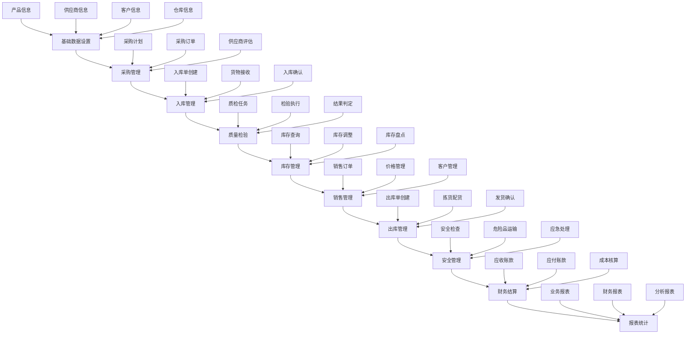

---

## 📦 详细业务流程

### 1. 基础数据管理流程

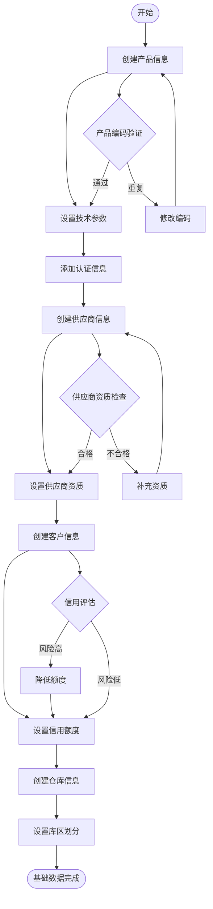

### 2. 采购管理流程

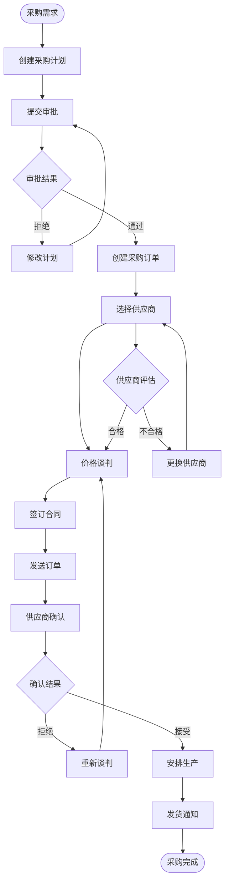

### 3. 入库管理流程

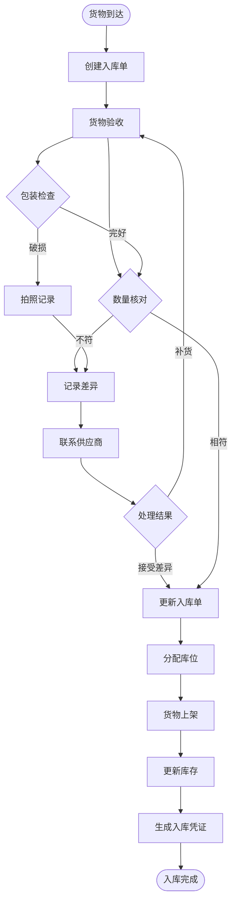

### 4. 质量检验流程

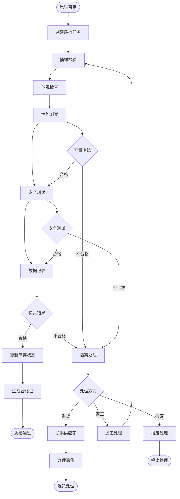

### 5. 销售管理流程

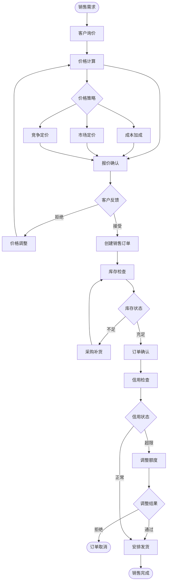

### 6. 出库管理流程

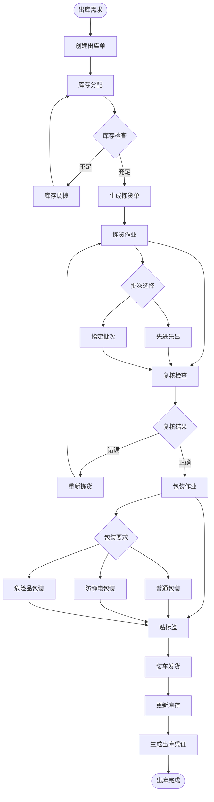

### 7. 安全管理流程

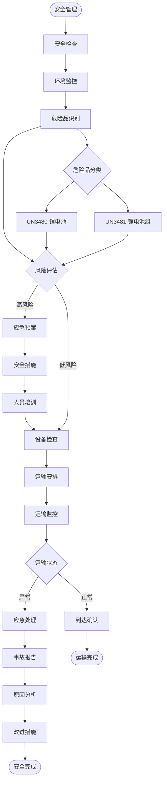

### 8. 财务结算流程

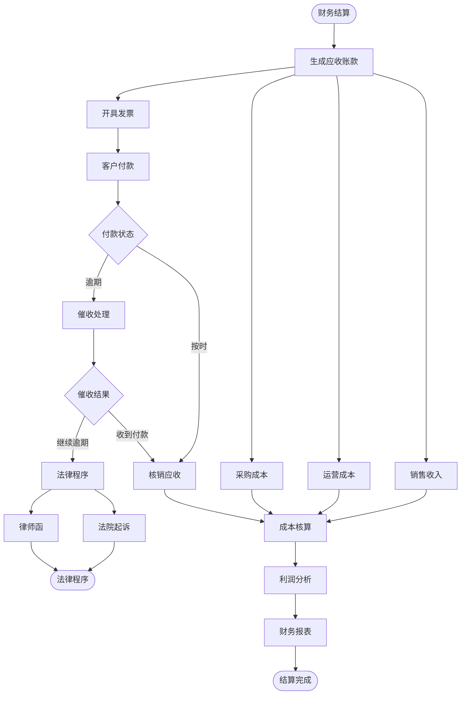

---

## 🔄 跨模块业务流程

### 完整采购到销售流程

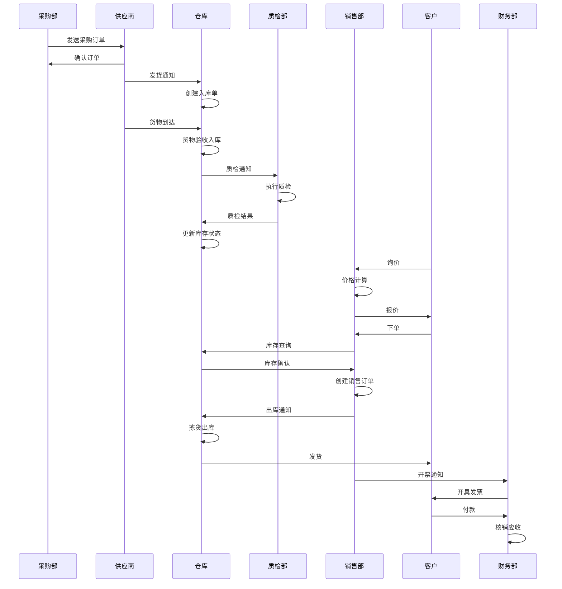

### 质量问题处理流程

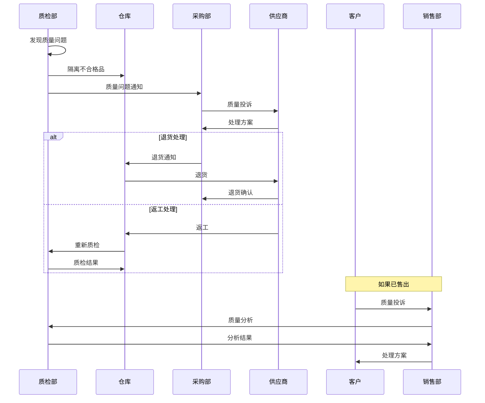

---

## 📊 业务流程KPI指标

### 关键绩效指标

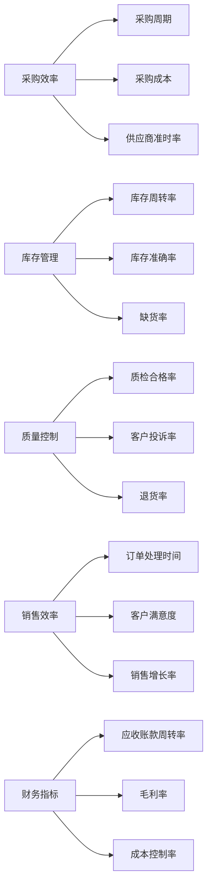

### 流程优化建议

1. **自动化程度提升**
   - 采购订单自动生成
   - 库存自动补货
   - 质检数据自动采集

2. **流程标准化**
   - 统一作业标准
   - 标准化质检流程
   - 规范化安全操作

3. **信息化集成**
   - 系统间数据同步
   - 实时状态更新
   - 移动端操作支持

4. **风险控制**
   - 供应商风险评估
   - 库存风险预警
   - 质量风险管控

---

## 📝 总结

本业务流程图文档提供了新能源电池进销存系统的完整业务流程可视化展示，包括：

1. **总体流程图**：展示各模块间的关系和数据流向
2. **详细流程图**：每个模块的具体操作步骤
3. **跨模块流程**：展示复杂业务场景的处理流程
4. **KPI指标**：业务流程的关键绩效指标

通过这些流程图，业务人员和开发人员可以：
- 快速理解业务流程
- 识别流程优化点
- 规范操作标准
- 提高工作效率

**建议**：
- 定期审查和更新流程图
- 根据实际业务调整流程
- 加强员工培训
- 持续优化改进