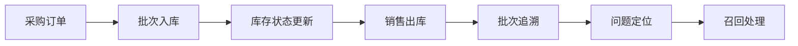
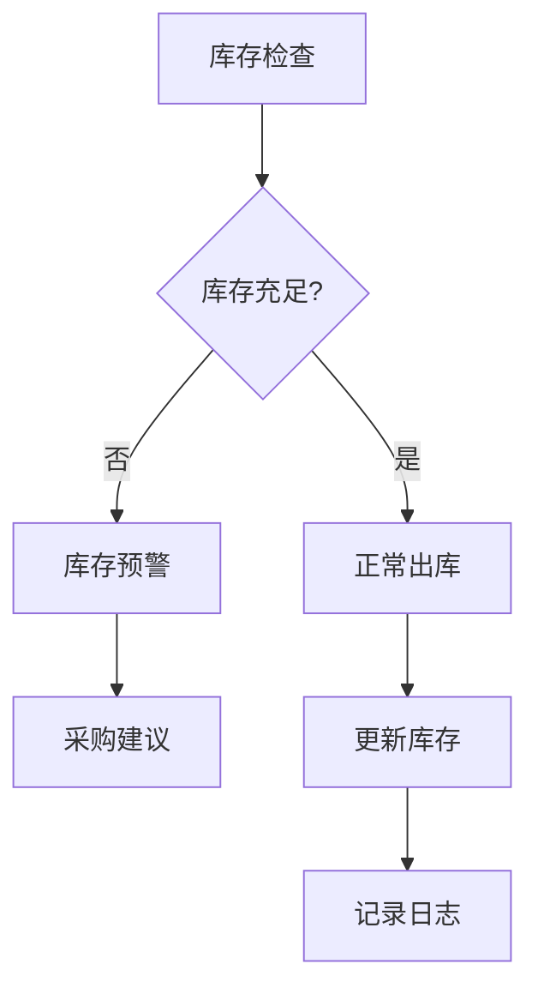

# 博链科技公司新能源电池进销存信息管理系统论文大纲

## 论文题目  
**博链科技公司新能源电池进销存信息管理系统的设计与实现**  
*(Design and Implementation of Inventory Management System for New Energy Batteries at Bolian Technology Company)*

---

## 摘要 (Abstract)

### 研究背景
随着新能源汽车行业的快速发展，新能源电池供应链管理面临前所未有的挑战。博链科技公司作为电池供应链的重要参与者，急需一套专业化的进销存管理系统来应对复杂的业务需求。

### 研究对象
博链科技公司现有的进销存管理存在以下痛点：
- 批次追溯困难，无法快速定位问题电池
- 库存管理粗放，缺乏精细化控制
- 多端数据不同步，影响决策效率
- 缺乏专业的新能源电池特性管理

### 研究目标
设计并实现一套基于现代化技术栈的新能源电池进销存管理系统，支持多端部署，实现全流程数字化管理。

### 核心技术架构
- **后端服务**: Nest.js + PostgreSQL + Redis
- **桌面端**: Tauri + HTML/CSS/JavaScript
- **移动端**: Taro + React Native
- **部署方案**: Docker + 云服务

### 核心功能模块
- 基础数据管理（产品、供应商、客户、仓库）
- 采购管理（计划、订单、入库、质检）
- 库存管理（实时库存、批次追溯、FIFO策略）
- 销售管理（订单、信用控制、出库、退货）
- 报表分析（库存报表、销售报表、采购报表）

### 成果价值
- 提升管理效率30%以上
- 降低库存成本25%
- 实现100%批次追溯
- 支持多端协同办公

**关键词：** 进销存管理系统；新能源电池；Nest.js；Tauri；Taro；批次追溯；供应链管理

---

## 目录

### 第一章 绪论
1.1 研究背景与意义  
1.2 国内外研究现状  
1.3 研究目标与内容  
1.4 论文组织结构  

### 第二章 系统需求分析
2.1 博链科技公司业务概述  
2.2 **核心需求识别**  
　　- 2.2.1 功能性需求
　　  - 基础数据管理（产品信息、供应商、客户、仓库）
　　  - 采购管理（采购计划、订单、批次入库、质检）
　　  - 库存管理（实时库存、批次追溯、FIFO策略、预警）
　　  - 销售管理（订单、信用控制、出库、退货）
　　  - 报表分析（库存报表、销售报表、采购报表）
　　  - 系统管理（用户权限、日志审计）
　　- 2.2.2 非功能性需求
　　  - 性能要求（响应时间<2秒，并发用户>100）
　　  - 安全性（数据加密、权限控制、审计日志）
　　  - 可靠性（99.9%可用性，数据备份）
　　  - 可追溯性（完整操作链，批次追踪）
2.3 业务流程建模  
2.4 数据流分析  

### 第三章 系统设计
3.1 系统架构设计
　　- 3.1.1 整体架构（微服务架构）
　　- 3.1.2 技术栈选型
　　  - 后端：Nest.js + TypeScript + PostgreSQL + Redis
　　  - 桌面端：Tauri + HTML/CSS/JavaScript
　　  - 移动端：Taro + React Native
　　- 3.1.3 部署架构（Docker + 云服务）
3.2 功能模块设计
　　- 3.2.1 基础数据模块
　　- 3.2.2 采购管理模块
　　- 3.2.3 库存管理模块
　　- 3.2.4 销售管理模块
　　- 3.2.5 报表分析模块（库存报表、销售报表、采购报表）
3.3 **数据库设计**
　　- 3.3.1 E-R图设计
　　- 3.3.2 核心表结构
　　  ```sql
　　  -- 批次表
　　  CREATE TABLE batch_info (
　　    id SERIAL PRIMARY KEY,
　　    batch_serial VARCHAR(50) UNIQUE NOT NULL,
　　    product_id INTEGER REFERENCES products(id),
　　    supplier_id INTEGER REFERENCES suppliers(id),
　　    production_date DATE,
　　    expiry_date DATE,
　　    initial_quantity INTEGER,
　　    remaining_quantity INTEGER,
　　    status VARCHAR(20),
　　    created_at TIMESTAMP DEFAULT NOW()
　　  );
　　  
　　  -- 库存表
　　  CREATE TABLE inventory (
　　    id SERIAL PRIMARY KEY,
　　    batch_id INTEGER REFERENCES batch_info(id),
　　    warehouse_id INTEGER REFERENCES warehouses(id),
　　    quantity INTEGER,
　　    status VARCHAR(20),
　　    last_updated TIMESTAMP DEFAULT NOW()
　　  );
　　  ```
　　- 3.3.3 索引优化策略
3.4 关键算法设计
　　- 3.4.1 FIFO策略实现
　　- 3.4.2 批次追溯算法
　　- 3.4.3 库存预警算法
3.5 接口设计（RESTful API）
3.6 用户界面设计

### 第四章 系统实现
4.1 开发环境与工具
　　- 4.1.1 开发环境配置
　　- 4.1.2 版本控制与协作
4.2 **核心模块实现**
　　- 4.2.1 基础数据管理
　　  ```typescript
　　  // Nest.js 产品服务示例
　　  @Injectable()
　　  export class ProductService {
　　    constructor(
　　      @InjectRepository(Product)
　　      private productRepository: Repository<Product>
　　    ) {}
　　    
　　    async createProduct(createProductDto: CreateProductDto): Promise<Product> {
　　      const product = this.productRepository.create(createProductDto);
　　      return await this.productRepository.save(product);
　　    }
　　  }
　　  ```
　　- 4.2.2 采购管理（重点：批次绑定）
　　  ```typescript
　　  // 批次入库实现
　　  async createBatch(batchData: CreateBatchDto): Promise<BatchInfo> {
　　    const batch = new BatchInfo();
　　    batch.batchSerial = this.generateBatchSerial();
　　    batch.productId = batchData.productId;
　　    batch.supplierId = batchData.supplierId;
　　    batch.initialQuantity = batchData.quantity;
　　    batch.remainingQuantity = batchData.quantity;
　　    batch.status = 'ACTIVE';
　　    
　　    return await this.batchRepository.save(batch);
　　  }
　　  ```
　　- 4.2.3 **库存管理（批次操作/FIFO实现/状态变更）**
　　  ```typescript
　　  // FIFO 出库算法
　　  async processFIFOOutbound(productId: number, quantity: number): Promise<OutboundResult> {
　　    const batches = await this.batchRepository.find({
　　      where: { productId, status: 'ACTIVE' },
　　      order: { productionDate: 'ASC' }
　　    });
　　    
　　    let remainingQuantity = quantity;
　　    const outboundItems = [];
　　    
　　    for (const batch of batches) {
　　      if (remainingQuantity <= 0) break;
　　      
　　      const outboundQty = Math.min(remainingQuantity, batch.remainingQuantity);
　　      batch.remainingQuantity -= outboundQty;
　　      remainingQuantity -= outboundQty;
　　      
　　      outboundItems.push({
　　        batchId: batch.id,
　　        quantity: outboundQty
　　      });
　　      
　　      if (batch.remainingQuantity === 0) {
　　        batch.status = 'DEPLETED';
　　      }
　　    }
　　    
　　    await this.batchRepository.save(batches);
　　    return { outboundItems, success: remainingQuantity === 0 };
　　  }
　　  ```
　　- 4.2.4 销售管理（信用控制）
4.3 数据库实现
　　- 4.3.1 数据库连接配置
　　- 4.3.2 事务管理
　　- 4.3.3 性能优化
4.4 安全性实现
　　- 4.4.1 JWT认证
　　- 4.4.2 权限控制
　　- 4.4.3 数据加密

### 第五章 系统测试与部署
5.1 测试策略
　　- 5.1.1 单元测试（Jest）
　　- 5.1.2 集成测试
　　- 5.1.3 系统测试
　　- 5.1.4 性能测试
5.2 测试用例设计
　　- 5.2.1 批次追溯测试用例
　　- 5.2.2 FIFO策略测试用例
　　- 5.2.3 并发操作测试用例
5.3 测试结果分析
5.4 部署方案
　　- 5.4.1 Docker容器化部署
　　- 5.4.2 云服务部署
　　- 5.4.3 备份策略

### 第六章 系统应用与效益分析
6.1 上线应用情况
6.2 **效益评估**
　　- 6.2.1 定量指标
　　  - 库存周转率提升30%
　　  - 人力成本降低25%
　　  - 盘点误差率从5%降至0.2%
　　  - 订单处理时间缩短50%
　　- 6.2.2 定性效益
　　  - 管理规范化程度显著提升
　　  - 决策支持能力增强
　　  - 客户满意度提升
6.3 用户反馈
6.4 改进方向

### 第七章 总结与展望
7.1 工作总结
7.2 创新点
　　- 7.2.1 新能源电池特性管理模型
　　- 7.2.2 多端协同架构设计
　　- 7.2.3 批次追溯算法优化
7.3 研究不足
7.4 未来方向
　　- 7.4.1 IoT设备集成
　　- 7.4.2 AI预测分析
　　- 7.4.3 区块链溯源

### 参考文献
- GB/T 7714 格式文献列表

### 附录
- 核心代码片段
- 数据库表结构
- 界面原型图
- 测试用例集

---

## 技术实现要点

### 1. 后端架构 (Nest.js)
```typescript
// 主要模块结构
src/
├── modules/
│   ├── auth/           # 认证模块
│   ├── products/       # 产品管理
│   ├── suppliers/      # 供应商管理
│   ├── customers/      # 客户管理
│   ├── inventory/      # 库存管理
│   ├── purchase/       # 采购管理
│   ├── sales/          # 销售管理
│   └── reports/        # 报表分析
├── common/
│   ├── decorators/     # 自定义装饰器
│   ├── guards/         # 守卫
│   ├── interceptors/   # 拦截器
│   └── pipes/          # 管道
└── config/             # 配置文件
```

### 2. 桌面端架构 (Tauri)
```html
<!-- 主要页面结构 -->
src/
├── pages/
│   ├── dashboard/      # 仪表板
│   ├── products/       # 产品管理
│   ├── inventory/      # 库存管理
│   ├── purchase/       # 采购管理
│   ├── sales/          # 销售管理
│   └── reports/        # 报表分析
├── components/         # 公共组件
├── utils/             # 工具函数
└── styles/            # 样式文件
```

### 3. 移动端架构 (Taro)
```typescript
// 主要页面结构
src/
├── pages/
│   ├── index/          # 首页
│   ├── inventory/      # 库存查询
│   ├── scan/           # 扫码功能
│   ├── orders/         # 订单管理
│   └── profile/        # 个人中心
├── components/         # 公共组件
├── utils/             # 工具函数
└── app.config.ts      # 应用配置
```

## 关键业务流程

### 批次追溯流程


### 库存管理流程


## 量化指标

### 系统性能指标
- API响应时间：< 2秒
- 并发用户数：> 100
- 系统可用性：99.9%
- 数据备份：每日自动备份

### 业务效益指标
- 库存周转率：提升30%
- 人力成本：降低25%
- 盘点误差率：从5%降至0.2%
- 订单处理时间：缩短50% 